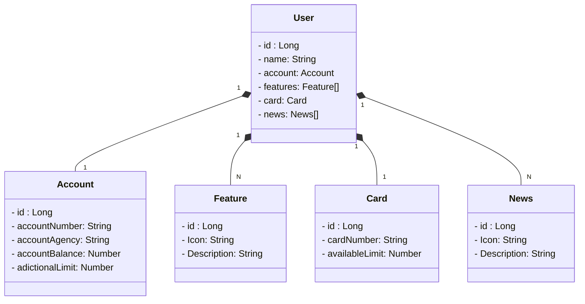

# Santander Bootcamp 2023
Projeto criado durante o BootCamp Santander Backend Java 2023

## Diagrama de Classes

```mermaid
classDiagram
    class User {
        - id : Long
        - name: String
        - account: Account
        - features: Feature[]
        - card: Card
        - news: News[]
    }
    
    class Account {
        - id : Long
        - accountNumber: String
        - accountAgency: String
        - accountBalance: Number
        - adictionalLimit: Number
    }
    
    class Feature {
        - id : Long
        - Icon: String
        - Description: String
    }
    
    class Card {
        - id : Long
        - cardNumber: String
        - availableLimit: Number
    }
    
    class News {
        - id : Long
        - Icon: String
        - Description: String
    }

    User "1" *-- "1" Account
    User "1" *-- "N" Feature
    User "1" *-- "1" Card
    User "1" *-- "N" News
```
